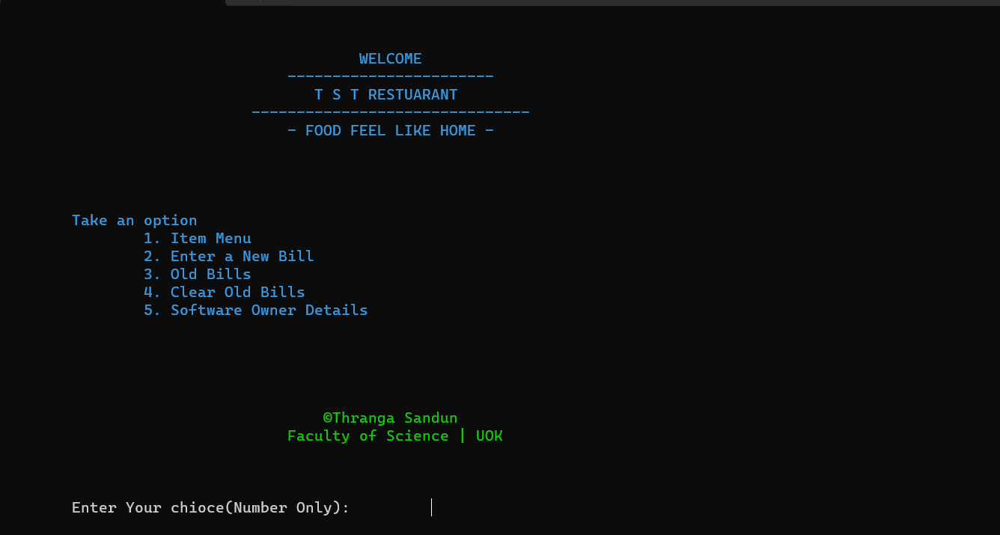
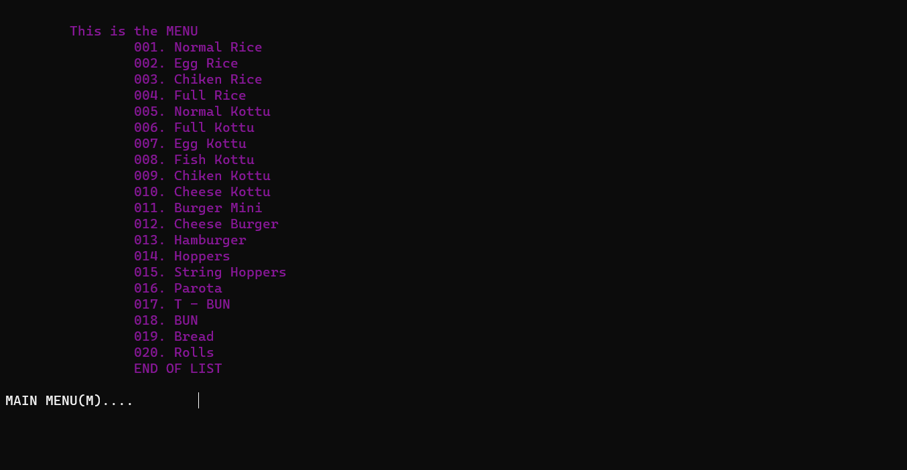
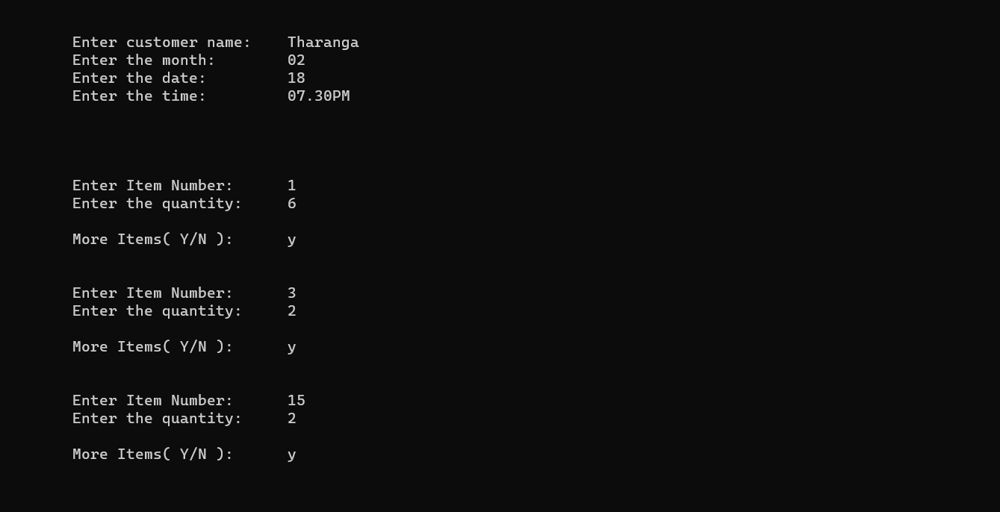
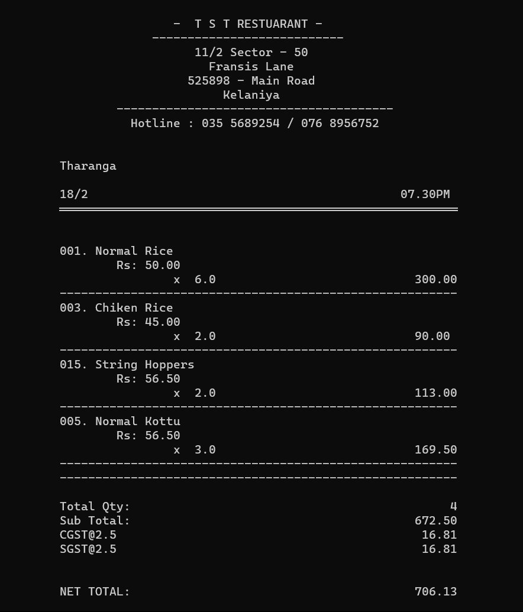
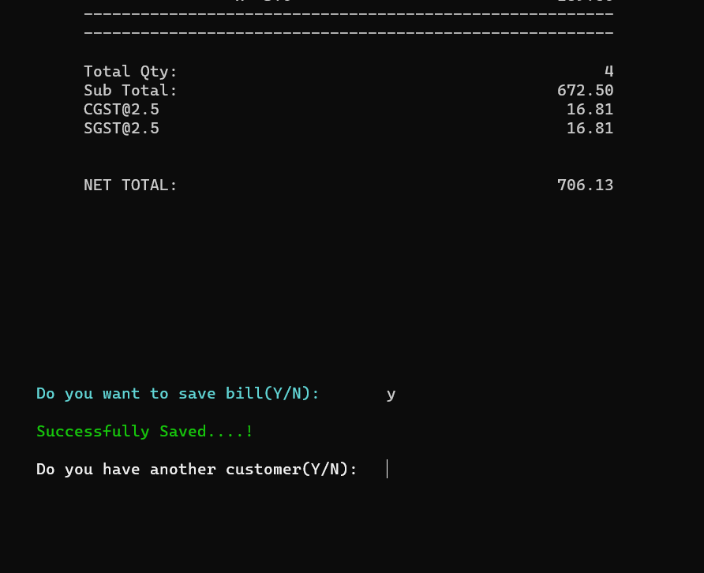

<h1 align="center">🚀 Basic Restaurant Billing System</h1>
<h5 align="center">💠 1st Semester C language Project</h5>

 
<h4 align="center">⚜️ Languages and Tools ⚜️</h4>

  

 
 
<h2>Home Page</h2>

User can choose below numbers for go ahead.

 
 
<h4>Choice 01</h4>

Using this option user can see the item menu.

 
 
<h4>Choice 02</h4>

 
 
<h4>Choice 03</h4>

 
 
<h4>Choice 04</h4>

